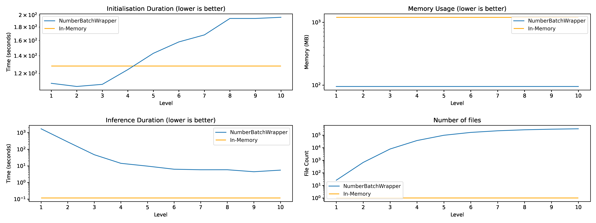

# NumberBatchWrapper
Wrapper around the ConceptNet Number Batch library to improve inference performance.


## 1. Installation

```
pip install git+https://github.com/RubenPants/NumberBatchWrapper.git
```

## 2. Package

This repository holds a wrapper for ConceptNet's [NumberBatch multilingual embeddings](https://github.com/commonsense/conceptnet-numberbatch). Due to the enormous size of the NumberBatch embeddings, memory usage may be sparse when using these embedding simultaneously with another memory-intensive application or Machine Learning Model. The discussed wrapper poses a solution to this problem by segmenting the data into a large set of files, which almost eliminates the memory (RAM) occupation of the embeddings, while sacraficing only slightly on inference speed.

This wrapper focuses on the multilingual embeddings and follows the [embedding scheme as specified by the NumberBatch documentation](https://github.com/commonsense/conceptnet-numberbatch#out-of-vocabulary-strategy). Aside from that, several other functionality is provided, to make the embedding process slightly more use-friendly:

- Automatically download the multilingual embeddings and extract the right language(s).
- Option to clean the data before embedding it.
- Option to provide a custom tokeniser, aside from the default whitespace tokenisation.

### 2.1. Usage

The [demos/1_usage.ipynb](https://github.com/RubenPants/NumberBatchWrapper/blob/master/demos/1_usage.ipynb) Jupyter Notebook walks you through the initialisation process of the model, and how to use it for inference afterwards. Once properly setup, using the `initialisation` method (which should only be run once on every machine), sentences can be embedded by simply calling the wrapper itself.

### 2.2. Performance

The wrapper's performance is validated to the in-memory usage of the embeddings in the [demos/2_performance.ipynb](https://github.com/RubenPants/NumberBatchWrapper/blob/master/demos/2_performance.ipynb) Jupyter Notebook. The results of this evaluation are presented by this image: 



As seen, the memory usage drops significantly, with almost only the notebook's memory usage remaining. The only embeddings kept in memory are those from the LRU-cache, which caches the last 1024 embeddings requested. Between segmentation-levels, there is a significant difference as well:

- A segmentation level less than four is deemed unusable due to the slow inference speeds.
- A large segmenation level (8 or greater) leads to a very large number of files created, with the side-effect of a slow inference speed.
- The sweet spot is around a segmentation level of 5 (default of the package) or 6, which keeps a relatively fast inference speed without the need of an exponentially large number of files to be created.